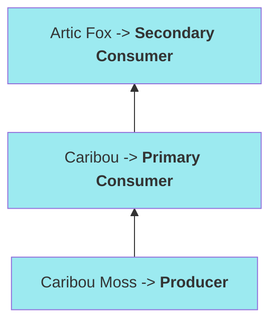

!!! note

    Please refrain from using dark mode as it does not properly work on this diagram.

```mermaid
 graph BT;
    classDef c1 fill:#9ceaf0,stroke:#333 stroke-width:20px, font-size:12pt;

    Caribou_["`Caribou -> **Primary Consumer** `"]
    Caribou_Moss_["`Caribou Moss -> **Producer** `"]
    Artic_Wolf_["`Artic Fox -> **Secondary Consumer** `"]

    Caribou_Moss_:::c1-->Caribou_:::c1
    Caribou_:::c1-->Artic_Wolf_:::c1
```

